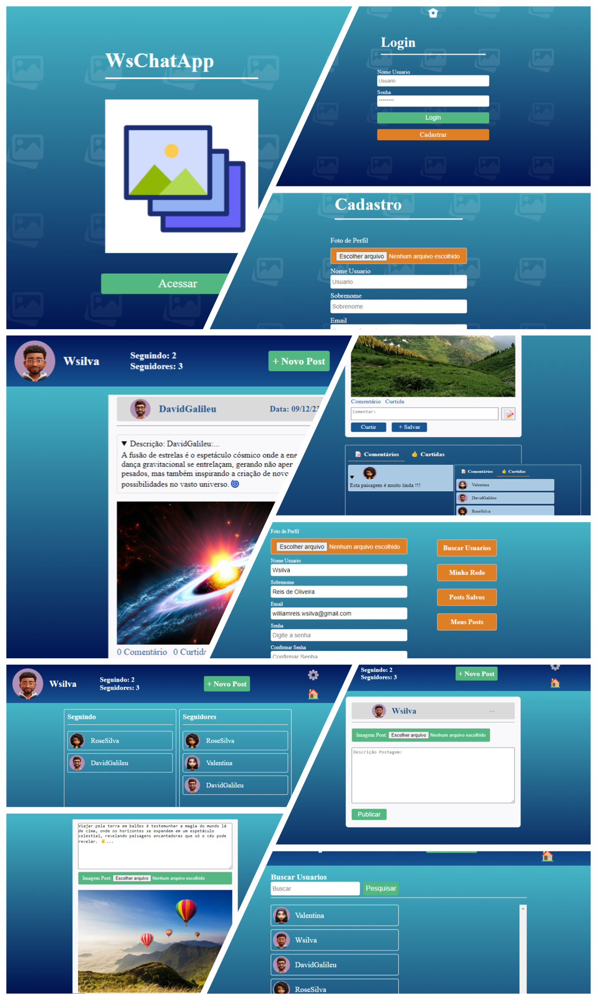

# WsChatApp

### 📜 Descrição

Este é um aplicativo de postagem de imagens desenvolvido com HTML, CSS, Django, Docker e PostgreSQL. Possui mais de 10 telas e funcionalidades como:

- Login e cadastro
- Publicação de posts com imagens
- Alteração de dados cadastrais
- Busca de usuários
- Rede de seguidores
- Postagens salvas

---



## ⚛️ Tecnologias Utilizadas

- HTML & CSS
- Django
- PostgreSQL
- Docker
- Railway (Deploy)
- Git & GitHub

---


## 🚀 Rodando Localmente

### Pré-requisitos

- Git
- Docker
- Python 3.11 (apenas se rodar sem Docker)


## 🐳 Como executar localmente com Docker

### 1. Clonar o repositório

```bash
git clone https://github.com/seu-usuario/seu-repo.git
cd seu-repo
```

## Acessar ambiente virtual

### 2. Acesse o ambiente virtual, senão crie e acesse
```bash
# criarambiente virtual
python -m venv venv

# acessar ambiente virtual
source venv/Scripts/activate
```


##  2. Criar variaveis ambiente .env

Crie um arquivo .env com o conteúdo:

```bash
# .env
DEBUG=1
SECRET_KEY=xxx
DJANGO_ALLOWED_HOSTS=xxx
DATABASE_ENGINE=django.db.backends.postgresql
DATABASE_NAME=xxx
DATABASE_USER=xxx
DATABASE_PASSWORD=xxx
DATABASE_HOST=db
DATABASE_PORT=5432
```

## 3. Subir os containers Docker

```bash
# !!! Somente Primeira vez ou quando mudar Dockerfile/dependências:
docker-compose up --build

# Para subir a aplicação (sem mudanças na imagem):
docker-compose up

# Para parar a aplicação:
docker-compose down

# Para parar e excluir volumes (zera o banco):
docker-compose down -v
```

O comando docker-compose up --build irá: 
- Subir o banco PostgreSQL local
- Aplicar migrações
- Coletar arquivos estáticos
- Rodar o servidor Django na porta 8010

### Acesse em: http://localhost:8010


## ATENÇÃO!!! Fazer Backup do Banco de Dados:

ATENÇÃO!!! -> Antes de parar a aplicação execute o backup do banco para não perder dados.
- Com a aplicação rodando acesse um terminal e rode:

```bash
# Criar backup do banco para restauração automática
docker exec -t container-wschatapp pg_dump -U wsilva -d wschatappdb --data-only --column-inserts > docker-entrypoint-initdb.d/initial_dump.sql

```


## Para o deploy na Railway 

1. Crie uma conta em https://railway.app
2. Clique em "New Project" → "Deploy from GitHub Repo"
3. Escolha este repositório
4. Na tela do projeto clique em adicionar > Data Base > PostgreSQL
5. No PostgreSQL copie as variáveis de conexão, como:
- DATABASE_HOST     -> PGHOST       ?
- DATABASE_NAME     -> PGDATABASE   ?
- DATABASE_USER     -> PGUSER       ?
- DATABASE_PASSWORD -> PGPASSWORD   ?
- DATABASE_PORT     -> PGPORT       ?
6. No projeto principal salve todas as variaveis ambiente necesárias + as do novo banco de dados PostgreSQL